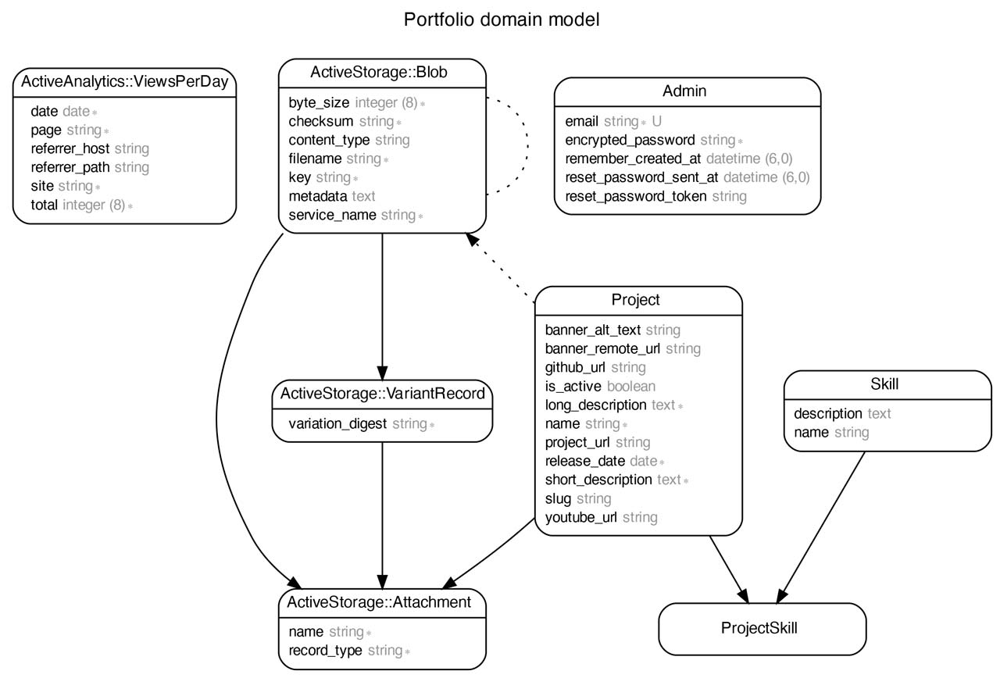

# [Personal portfolio](https://www.jeanguillet.com)

## About

This project started as I was looking for a way to showcase my creative and tech projects, while still building on the coding skills I had acquired during spring 2022 [Le Wagon](https://github.com/lewagon)'s bootcamp. Instead of going with a CMS or a static site generator, I went with a blank Rails app, and built a simple custom CMS on it, to CRUD objects. I believe this stack gives a lot of flexibility, and is a great way to practice my Rails skills.

## Tools

* [Ruby 3](https://www.ruby-lang.org/en/) and [Rails 7](https://rubyonrails.org/) for the back-end

* [TailwindCSS](https://tailwindcss.com/) for styling

* [PostgreSQL](https://www.postgresql.org/) for database operations

* [Cloudinary](https://cloudinary.com/) for images hosting

* [Mailgun](https://www.mailgun.com/) for the contact form

* [Active analytics](https://github.com/BaseSecrete/active_analytics) for cookie-less traffic analytics

* [Heroku](https://www.heroku.com) to host the app

* [Cloudflare](https://www.cloudflare.com) for DNS config and SSL certificate

## Run locally

1. Clone the repo: `git clone git@github.com:John35961/portfolio.git`

2. In `development`, the app requires the following environnement variables:

* `APEX` which resolves to the bare live domain, to generate `production` URLs in the email template used when a new contact form is submitted. Useful to test emails locally with [MailCatcher](https://mailcatcher.me/) for instance
* `LOCALHOST`, IPV4's localhost (likely to be `127.0.0.1`) for ActionMailer to work locally
* `CLOUDINARY_URL`, to use [Cloudinary](https://cloudinary.com/) image hosting for `Project` objects. You can get an API key by creating a free account (the key starts with `cloudinary://`)
You can also use, but not mandatory:
* `NGROK_HOST` if you want to forward your `localhost:3000` on the web via [ngrok](https://ngrok.com/). Make sure to exclude `https://` from the variable, and restart the `development`server after setting it

3. Run `bin/rails bundle` to install required gems in `development`

4. Then go with `bin/rails tailwindcss:install` to initialize the [tailwindcss-rails](https://github.com/rails/tailwindcss-rails) gem

5. Create database and run migrations with `bin/rails db:setup`

6. Finally, run the server with `bin/dev`

7. Then visit: <http://localhost:3000>

## Main routes

* `/projects`

* `/projects/:id` where `id` is actually `Project`'s URL slug generated by [friendly_id](https://github.com/norman/friendly_id)

* `/dashboard`, protected route to the custom-made CMS dedicated to `Project` objects

* `/analytics`, protected route to [Active analytics](https://github.com/BaseSecrete/active_analytics) dashboard

## Main models

* `Project`, describing a project I've done, with attributes such as its GitHub URL, description, associated Youtube video or release date. A project can have many `Skill` objects

* `ProjectSkill`, association table between `Project`and `Skill`

* `Skill`, describing my skills. Skills can live on their own, but they make more sense when linked to a project, therefore a skill can have many `Project` objects

## Schema's diagram

Made with [rails-erd](https://github.com/voormedia/rails-erd)
